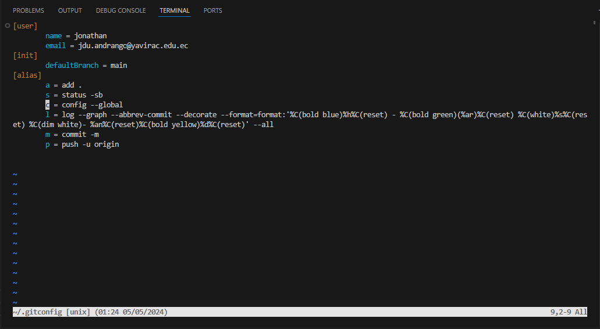

# Instalacion de Git

Facilito solo ir a la pagina oficial de [ git ](https://git-scm.com/)  descargar el archivo de instalacion y siguiente todo hasta finalizar.

y ya tendremos [ git ](https://git-scm.com/) localmente en nuestra computadora, para estar seguros de que tenemos git podemos abrir una powershell de windows y colocar el siguiente comando.

```
git --version
```

# Configuracion

para poder configurar [ git ](https://git-scm.com/) veremos como podemos realizarlo de dos formas  que son atraves del ingreso al archivo principal de [ git ](https://git-scm.com/) y configurarlo manualmente  y por medio de una serie de comandos ingresados en el powershell, terminal o la terminal de git que ya tenemos con la instalacion principal y a la que se accede con click derecho en  cualquier carpeta o en el escritorio.

## Archivo de configuracion de git

```
git config --global -e
```

para poder configurar devemos ingresar los siguentes datos o podemos copiar todo y procemos a pegarlo en el archivo de configuracion borrando todo lo anterior escrito en este archivo.

Ventajas.

* Esta configuracion nos indica el usuario el mail por defecto que tendremos en git
* Tambien el nombre de la rama por defecto con la cual se iniciara el seguimiento en git
* Unos **Alias** (muy pronto hableremos mas de los alias y sus beneficios) que considero que son muy importantes o practicos de uso comun o diario



# configuracion de git local

```
[user]
name = jonathan
email = jdu.andrango@yavirac.edu.ec
[init]
defaultBranch = main
[alias]
a = add .
s = status -sb
c = config --global
l = log --graph --abbrev-commit --decorate --format=format:'%C(bold blue)%h%C(reset) - %C(bold green)(%ar)%C(reset) %C(white)%s%C(reset) %C(dim white)- %an%C(reset)%C(bold yellow)%d%C(reset)' --all
m = commit -m
p = push -u origin
```

## Comandos para el uso de git

comando para el **inicio de git** en nuestro proyecto, en cualquier proyecto que se desee solo ubicandonos en la carpeta raiz de nuestro proyecto y colocar el siguente comando en la terminal o en la terminal de nuestro editor de codigo visual estudi code.
